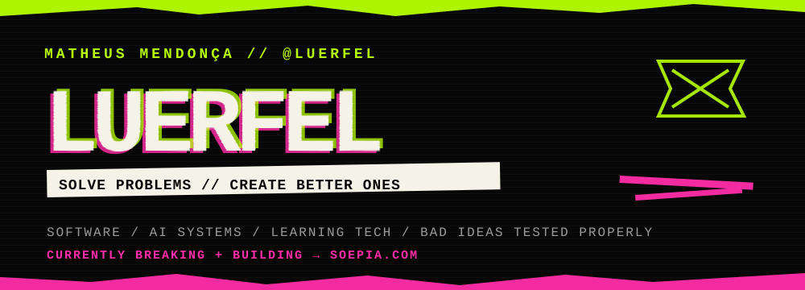
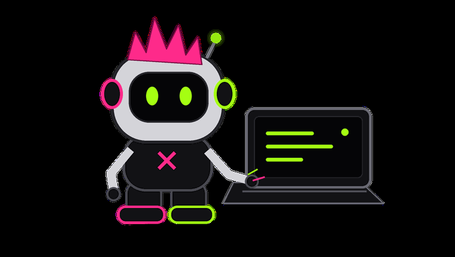
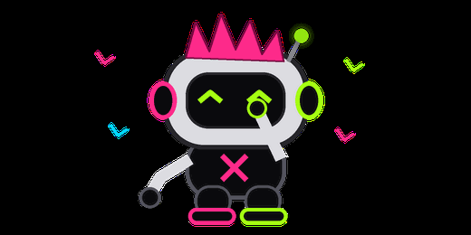

<div align="center">
  
</div>

<br />

```text
STATUS  :: alive
BASE    :: Campinas, SP — Brazil
BUILD   :: Soepia
MODE    :: ship / break / measure / rebuild
RULE    :: if it looks finished, test harder
```

> **A punk who is good at both solving and creating problems.**

I build software where **product, AI, data and learning systems** collide.  
I like ugly problems, measurable answers and systems that survive contact with real users.

Right now most of that energy goes into [**Soepia**](https://soepia.com).

<br />

<div align="center">
  
</div>

<br />

---

## `// CURRENT DAMAGE`

### SOEPIA — `BUILDING / BREAKING / REBUILDING`

Not a portfolio project. Not a tutorial clone.  
A real product, with real users, real infrastructure and all the annoying edge cases that come with that.

```text
[ interface ]  React / TypeScript / Vite
[ backend   ]  Firebase / Node.js / server functions
[ ai        ]  model routing / structured output / evals / context design
[ systems   ]  reliability / cost / observability / data architecture
[ learning  ]  adaptive study / evidence / feedback / next-action logic
```

The interesting part is not **"adding AI"**.

The interesting part is deciding **where AI should not be trusted**, what should be deterministic, what should be measured, and what happens when the model, network or architecture fails.

→ [**soepia.com**](https://soepia.com)

---

## `// WEAPONS OF CHOICE`

<table>
<tr>
<td width="50%" valign="top">

### `01 / BUILD`


<br /><br />

Interfaces, product systems and things users actually touch.

</td>
<td width="50%" valign="top">

### `02 / RUN`


<br /><br />

Backends, data flows and infrastructure that need to survive production.

</td>
</tr>

<tr>
<td width="50%" valign="top">

### `03 / THINK`


<br /><br />

Model behavior, evaluation, routing and deciding what should remain deterministic.

</td>
<td width="50%" valign="top">

### `04 / BREAK`


<br /><br />

Tests, edge cases and finding the failure before production does.

</td>
</tr>
</table>

<div align="center">
  <sub>tools change. understanding failure modes matters more.</sub>
</div>

---

## `// SIGNAL`


<div align="center">

<a href="https://www.linkedin.com/in/matheus-mendon%C3%A7a-65ba63243/">
  
</a>
<a href="mailto:mluerfel@gmail.com">
  
</a>
<a href="https://soepia.com">
  
</a>

<br /><br />

<code>BUILD SOMETHING // BREAK ASSUMPTIONS // LEAVE BETTER EVIDENCE</code>

<br /><br />



</div>
